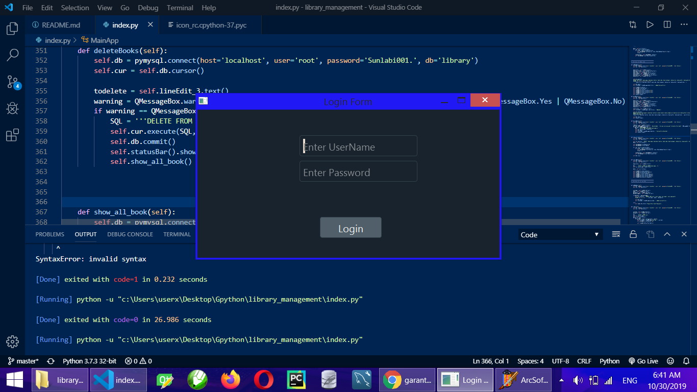
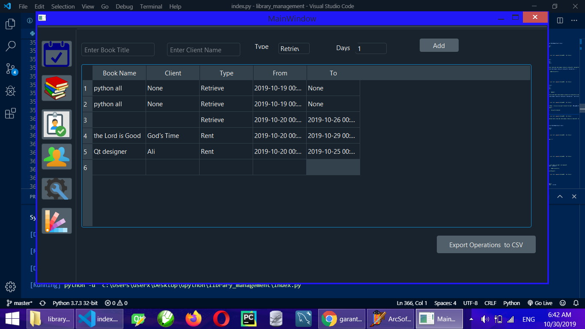
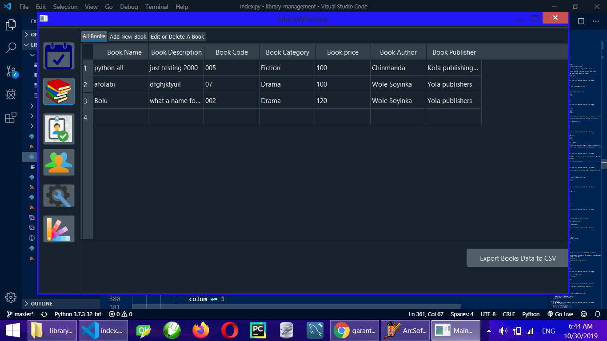

# Library management

Library Management software for managing library.

## INTRODUCTION

This a Library Managment Software that Helps manage library Operations, Catelogs This helps to keep the records of whole transactions of the books available in the library. There are many features which helps Users to keep records of available books as well as issued books. 

---
### FEATURES

* Add Publisher, Edit Publisher and Delete Publisher and other Details
* Add Users, Edit Users, Delete User and Many More
* Add Client, Edit Client, Delete Client and Many More
* Display Daily Operations
* Display Users
* Display All Books in the Library
* Add Books, Edit Books and Delete Books
* Add Author, Edit Author and Delete Author
* Change Theme
* Export Daily Operations to csv
* Export Client Details to csv
* Books Details including Publisher, Author, book code, price for rent and many more

---

## Prerequsite 

* Install Python 3.7.3
* PyQt5==5.11.3
* MySql
* PyMySQL==0.9.3
* xlrd==1.2.0
* xlsxwriter==1.2.2

# Installing

You can Run the git clone command on you machine within your already created Virtual Enviroment and simply run the Index file from your commandline or Terminal after cloning
python index.py

### Please do not forget to use your own local mysql password in the space to create and connect to the mysql database

# ScreenShot

